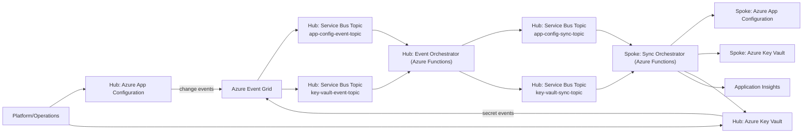
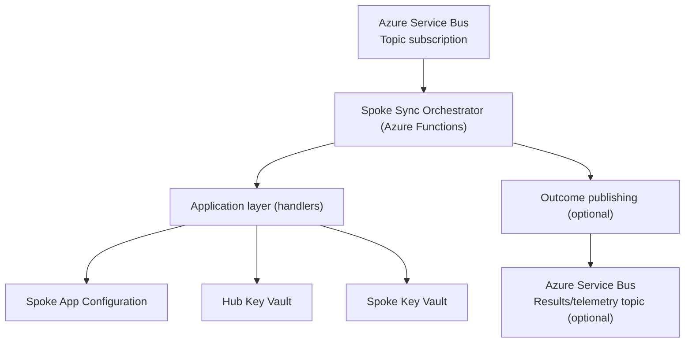
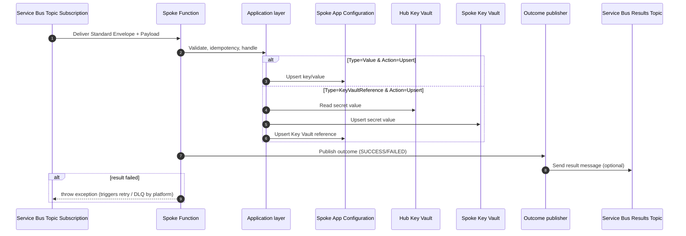

# Architecture – Config Management (Hub ↔ Spoke Sync)

This document describes the intended architecture for Hub ↔ Spoke configuration and secret synchronization.
It is based on [docs/Agent-Knowledge-Baseline.md](Agent-Knowledge-Baseline.md) plus the design requirements captured in this document.

## Scope

- Defines the hub/spoke sync model for configuration settings and secrets.
- Uses separate ingress vs normalized topics for both App Configuration and Key Vault events.
- Standardizes a sync envelope (including `EventGridId`, GUID `CorrelationId`, and `traceparent`).
- Defines tracing, idempotency, validation, retries, and DLQ handling requirements.

---

## C4 – Level 1 (System Context)

### System
**ConfigManagement** synchronizes configuration and secrets from a **Hub** Azure subscription into one or more **Spoke** subscriptions.

### Primary actors
- **Platform/Operations**: owns the hub configuration source and deploys the spoke sync service.
- **Workload teams (Spokes)**: consume configuration from the spoke’s App Configuration and Key Vault.

### External systems and dependencies
- **Azure App Configuration (Hub)**: source of key/value changes.
- **Azure Key Vault (Hub)**: source of secrets referenced by configuration and a source of secret version events.
- **Azure Event Grid**: delivers App Configuration change events and Key Vault secret events.
- **Azure Service Bus (Hub)**: topics/subscriptions used for ingress and normalized sync work.
- **Azure Functions (Spoke)**: executes sync operations.
- **Azure App Configuration (Spoke)**: target store for key/value settings and Key Vault references.
- **Azure Key Vault (Spoke)**: target store for secrets.
- **Application Insights**: telemetry for the Functions worker.

### System context (conceptual)


### Service Bus resources (naming)

The architecture uses separate topics for **raw ingress events** and **normalized sync work**:

| Topic | Purpose |
|---|---|
| `app-config-event-topic` | Raw Azure App Configuration change events delivered by Event Grid. |
| `app-config-sync-topic` | Normalized App Configuration sync messages consumed by spokes. |
| `key-vault-event-topic` | Raw Azure Key Vault secret events delivered by Event Grid. |
| `key-vault-sync-topic` | Normalized Key Vault sync messages consumed by spokes. |

Per-spoke subscription naming (normalized topics):

- `app-config-sync-topic/{Organisation}/{EnvironmentName}`
- `key-vault-sync-topic/{Organisation}/{EnvironmentName}`

Each subscription has its own dedicated DLQ at the broker level (standard Service Bus behavior).

Optional (recommended): publish per-message processing outcomes to a dedicated results/telemetry topic (for example, `app-config-results-telemetry`).

---

## C4 – Level 2 (Containers)

### Container inventory (planned)

#### Hub container
- **Hub Event Orchestrator (Azure Functions)**
  - Triggered by Service Bus subscriptions that receive Event Grid-delivered ingress events.
  - Responsibilities:
    - Validate ingress event types
    - Enforce filtering rules (App Configuration label `SYNC_SPOKE`, Key Vault secret tag `spokeSync: true`)
    - Read current state (App Configuration values and/or Key Vault metadata) as needed
    - Publish normalized sync messages to the appropriate sync topics

#### Spoke container
- **Spoke Sync Orchestrator (Azure Functions)**
  - Triggered by Service Bus topic subscriptions on the normalized sync topics.
  - Responsibilities:
    - Process normalized sync messages (App Configuration and Key Vault)
    - Upsert App Configuration keys into the spoke
    - Upsert Key Vault secrets into the spoke (including for App Configuration Key Vault reference scenarios)
    - Publish processing outcomes for observability (optional but recommended)

#### Application layer (logical)
- Core orchestration logic
- Outcome/result publishing orchestration (optional but recommended)

#### Shared libraries (logical)
- Service Bus publishing helpers
- App Configuration client wrapper
- Key Vault secret client wrapper
- Shared contracts/models (envelopes + payloads)

### Container interactions (conceptual)


---

## C4 – Level 3 (Components)

### Hub Event Orchestrator (Azure Functions)

- Triggered by Service Bus subscriptions on the ingress topics.
- Validates ingress events and applies filtering rules.
- Produces normalized sync messages using the standard envelope.

### Spoke Sync Orchestrator (Azure Functions)

- Triggered by Service Bus subscriptions on the normalized sync topics.
- Validates and normalizes metadata:
  - Ensure `CorrelationId` exists (GUID)
  - Parse/propagate `traceparent`
  - Enforce idempotency before side effects
- Performs the upsert operation.
- Publishes an outcome message for observability (optional but recommended).
- Throws on failure so the Functions + Service Bus retry/DLQ policies re-drive the message.

### Spoke processing behavior

**App Configuration sync**

- If `Payload.Type = Value`: upsert the App Configuration `Key` and `Value` into the spoke.
- If `Payload.Type = KeyVaultReference`:
  - Copy the secret identified by `KeyVaultSecretId` from hub Key Vault to spoke Key Vault.
  - Upsert an App Configuration Key Vault reference at `Key` that points to the spoke secret URI.

**Key Vault sync**

- Upsert the secret identified by `SecretId` (and named by `SecretName`) from hub Key Vault to spoke Key Vault.

---

## Hub ↔ Spoke Message Flow

### End-to-end flows

This design separates **ingestion** (raw Event Grid events) from **processing/publishing** (normalized sync messages).

#### Flow A — App Configuration change → App Config sync

1. Hub App Configuration key/value changes occur.
2. Event Grid emits an App Configuration change event.
3. Event Grid delivers the raw event into the **Service Bus topic** `app-config-event-topic` (ingress).
4. Hub Event Orchestrator (Azure Functions) is triggered by that subscription.
5. Hub Event Orchestrator:
  - Validates the event type
  - Validates `label == SYNC_SPOKE`
  - Reads the latest key value
  - Determines whether the setting is a plain value or a Key Vault reference
6. Hub publishes a normalized sync message to `app-config-sync-topic`.
7. Each spoke processes the message from its subscription.
8. Spoke upserts the key into spoke App Configuration; if a Key Vault reference, it also synchronizes the referenced secret hub→spoke.
9. Spoke publishes a result message for observability (optional but recommended).

#### Flow B — Key Vault secret new version → Key Vault sync

1. Hub Key Vault secret version is created/updated.
2. Event Grid emits a Key Vault secret event.
3. Event Grid delivers the raw event into the **Service Bus topic** `key-vault-event-topic` (ingress).
4. Hub Event Orchestrator:
  - Validates the event type
  - Validates secret tag `spokeSync: true`
5. Hub publishes a normalized secret sync message to `key-vault-sync-topic`.
6. Each spoke processes the message from its subscription and upserts the latest secret value hub→spoke.

### Hub message classification and mapping

The Hub Event Orchestrator’s purpose is to translate App Configuration change notifications into the canonical message consumed by the Spoke Sync Orchestrator.

**Input (from ingress topic)**
- App Configuration change event delivered via Event Grid (e.g., key-value modified/deleted).

#### Event types

| Event type | Meaning |
|---|---|
| `Microsoft.AppConfiguration.KeyValueModified` | Key-value created or replaced (treated as `SyncAction.Upsert`). |

Design assumption: delete handling is out of scope; deleted events are not normalized into sync work.

#### Event schema (example)

Event Grid delivers an array of events; the hub orchestrator uses `data.key` and the event type to drive sync behavior:

```json
[
  {
    "id": "84e17ea4-66db-4b54-8050-df8f7763f87b",
    "topic": "/subscriptions/.../providers/microsoft.appconfiguration/configurationstores/contoso",
    "subject": "https://contoso.azconfig.io/kv/Foo?label=FizzBuzz",
    "data": {
      "key": "Foo",
      "label": "FizzBuzz",
      "etag": "FnUExLaj2moIi4tJX9AXn9sakm0"
    },
    "eventType": "Microsoft.AppConfiguration.KeyValueModified",
    "eventTime": "2019-05-31T20:05:03Z",
    "dataVersion": "1",
    "metadataVersion": "1"
  }
]
```

**Decision: Value vs Key Vault reference**
- If the changed App Configuration setting represents a plain value → set `Payload.Type = Value`.
- If the changed setting represents a Key Vault reference → set `Payload.Type = KeyVaultReference`.

**Output (to `app-config-sync-topic`)**

Normalized envelope (standard): `EventGridId`, GUID `CorrelationId`, `traceparent`, `TimestampUtc`, `Payload`.

App Configuration sync payload fields:
  - `Key`: the App Configuration key
  - `Type`: `Value` or `KeyVaultReference`
  - `SyncAction`: `Upsert`
  - `Value`: required when `Type = Value`
  - `KeyVaultSecretId`: required when `Type = KeyVaultReference`

### Spoke execution flow


---

## Key Design Decisions

1. **Clean Architecture alignment**
   - Separate Domain/Application/Infrastructure projects and a dedicated Functions host for the Spoke orchestrator.

2. **Shared package reuse as a hard constraint**
  - Use shared libraries for App Configuration, Key Vault, Service Bus, and shared contracts.

3. **Event envelope standardization**
  - Standardize on an envelope that always includes `EventGridId`, GUID `CorrelationId`, `traceparent`, `Payload`, and `TimestampUtc`.

4. **Result topic pattern for observability**
   - Every processed message leads to a result publication (`SUCCESS`/`FAILED`), enabling downstream monitoring without scraping function logs.

5. **Authentication via Azure.Identity factories**
   - Auth is centralized and selected via options (`Default`, `ManagedIdentity`, `ClientSecret`, etc.).
   - Deployment intent (per baseline) is Managed Identity, but factories support additional modes for local development/testing.

6. **Failure signaling uses exceptions after result publishing**
   - The Function publishes a result and then throws on failure, relying on Azure Functions + Service Bus retry/DLQ behavior for delivery guarantees.

7. **App Configuration semantics are explicit**
   - Create-only (`Add*`) vs upsert (`Set*`) methods are distinct.
   - Key Vault references use the official content type (`application/vnd.microsoft.appconfig.keyvaultref+json`).

## Requirements

### Objectives

1. Standardize the message envelope
2. Eliminate duplicate logic
3. Ensure idempotent processing
4. Centralize validation logic
5. Enforce tracing standards
6. Normalize event transformation (raw → normalized)
7. Separate ingestion, processing, and publishing layers

### Logging & observability

All Functions (Hub and Spoke) should:

- Generate `CorrelationId` if missing (GUID)
- Propagate `traceparent`
- Log `TraceId`, `SpanId`, and `CorrelationId` (structured logging)
- Support retries and DLQ handling via Service Bus + Functions runtime
- Enforce idempotency

### Non-functional requirements

- At-least-once delivery support
- Idempotent updates
- Horizontal scalability
- Retry with exponential backoff
- Dead-letter queue handling
- W3C trace compliance (ID sizes; `traceparent` propagation)

### Assumptions

- Hub is source of truth
- Spokes never write back to Hub
- Only `Upsert` is supported
- Delete flow is not implemented

---

## Configuration Surface

The Functions apps require configuration for:

- Service identity / environment metadata: `ORGANISATION`, `REGION`, `ENVIRONMENT_TIER`, `ENVIRONMENT_NAME`, `SERVICE_NAME`
- Service Bus:
  - `ServiceBus__FullyQualifiedNamespace`
  - Topic names:
    - `app-config-event-topic`, `app-config-sync-topic`
    - `key-vault-event-topic`, `key-vault-sync-topic`
  - Subscription names (per spoke):
    - `app-config-sync-topic/{Organisation}/{EnvironmentName}`
    - `key-vault-sync-topic/{Organisation}/{EnvironmentName}`
  - Optional results/telemetry topic name (if used): `app-config-results-telemetry`
  - plus `ServiceBus__AuthType`, `ServiceBus__ManagedIdentityClientId`, etc.
- App Configuration:
  - `AppConfiguration__Endpoint`
  - plus `AppConfiguration__AuthType`, `AppConfiguration__ManagedIdentityClientId`, etc.
- Key Vault:
  - `KeyVault__LocalVaultUri`, `KeyVault__HubKeyVaultUri`
  - plus `KeyVault__AuthType`, `KeyVault__ManagedIdentityClientId`, etc.
- Storage/idempotency placeholders:
  - `STORAGE_ACCOUNT_TABLE_URI`, `STORAGE_ACCOUNT_BLOB_URI`, `IDEMPOTENCY_TABLE_NAME`

These settings are intended to support **message idempotency** using the Azure Functions storage account (see Idempotency section below).

---

## Idempotency (Design)

The system processes messages from Service Bus with **at-least-once delivery** semantics. To avoid duplicated side-effects (e.g., repeated writes/secret copies) during retries, lock-loss, or duplicate deliveries, the Spoke Sync Orchestrator should implement an explicit idempotency mechanism.

### Storage location

- Use the **Spoke Function App’s storage account** (the same storage account created for the Functions host).
- Persist idempotency state in **Table Storage**.
- Table name is configured by `IDEMPOTENCY_TABLE_NAME`.

**Required configuration**

- `STORAGE_ACCOUNT_TABLE_URI`: the Table endpoint for the Function storage account (e.g., `https://<storage>.table.core.windows.net`).
- `IDEMPOTENCY_TABLE_NAME`: the table name (example from Terraform: `configSyncIdempotency`).
- `IDEMPOTENCY_TABLE_NAME`: the table name (for example, `configSyncIdempotency`).

### Table schema (logical)

Store one row per processed message/event:

- `PartitionKey`: constant (e.g., `ConfigSync`).
- `RowKey`: **idempotency key**.
- Columns:
  - `Status`: `Started` | `Completed` | `Failed`
  - `CorrelationId`
  - `StartedUtc`, `CompletedUtc`
  - Optional operational fields: `LastError`, `EventType`, `Key`, `Type`, `SyncAction`

### Idempotency key

Preferred: use the Event Grid event identifier provided as `EventGridId` in the standard envelope. In that case:

- `RowKey = EventGridId`

Fallbacks:

- If `EventGridId` is missing (should be rare), use `CorrelationId` (GUID) when available.
- If neither is available, derive a stable key from envelope + payload and hash it (e.g., SHA-256) to keep `RowKey` short.

### Processing flow

On message receipt:

1. **TryStart**: attempt to insert a new idempotency row (`Status=Started`).
   - If insert succeeds → proceed with the sync.
   - If insert conflicts (row exists):
     - If `Status=Completed` → treat as duplicate and **short-circuit** without reapplying changes; publish a `SUCCESS` result (optionally with a message like “Duplicate suppressed”).
     - If `Status=Started` → treat as “in-flight elsewhere” and fail fast (throw) so the platform retry policy can re-drive later.
     - If `Status=Failed` → allow retry by updating the row back to `Started` (using optimistic concurrency via ETag) or by leaving it as-is and letting a retry policy decide.

2. Execute the existing sync logic (App Configuration and/or Key Vault).

3. **MarkCompleted**: update the row to `Completed` and set `CompletedUtc`.

4. On exception:
   - **MarkFailed** (record error context if needed)
   - Re-throw so Service Bus retries/DLQ semantics still apply.

### Security / RBAC

The Function App managed identity requires permission to the storage account:

- `Storage Table Data Contributor` on the **Function storage account**.

### Operational considerations

- Data retention: idempotency rows grow over time. Define a retention window and a cleanup strategy (timer-driven cleanup function or storage lifecycle management where available).
- Observability: include `EventGridId`, `CorrelationId`, and `traceparent` (and the derived `TraceId`/`SpanId`) in logs and result messages so operators can correlate duplicates/retries with idempotency decisions.

---

## Distributed Tracing & Telemetry (Design)

This design follows the guidance in [docs/distributed-tracing-agent-knowledge.md](distributed-tracing-agent-knowledge.md).

### What to cover in the implementation

#### ID standards

| ID Type | Standard | Format | Length |
|---|---|---|---|
| `TraceId` | W3C Trace Context | 16 bytes (hex) | 32 hex characters |
| `SpanId` | W3C Trace Context | 8 bytes (hex) | 16 hex characters |
| `CorrelationId` | GUID | 8-4-4-4-12 hex format | 36 characters (incl. hyphens) |

`traceparent` (envelope field) is represented as:

  "{TraceId}-{SpanId}"

- **One Trace ID per end-to-end workflow**: the Trace ID should be created at the system boundary (in this architecture, the hub ingress publisher or the spoke consumer if the upstream does not supply it) and then propagated unchanged across messages and results.
- **One Span per operation**: each service execution should record its own span for message processing and any downstream calls (App Configuration, Key Vault, Service Bus).
- **Prefer automatic propagation**: rely on framework/SDK instrumentation (Application Insights and/or OpenTelemetry) to extract/inject W3C trace context where possible.
- **W3C Trace Context compatibility**: ensure trace context can be represented as `traceparent`/`tracestate` in transport metadata (especially across asynchronous messaging).
- **Logging uses telemetry context**: all logs emitted while processing a single message should carry `EventGridId`, `CorrelationId`, and `traceparent` (and/or derived `TraceId` and `SpanId`) as structured fields (via a logging scope at the Functions entrypoint).

### Message contracts (what must be present)

The standard sync envelope includes `EventGridId`, a GUID `CorrelationId`, and `traceparent`. `TraceId` and `SpanId` are derived from `traceparent` for logging and correlation.

When available, the publishers should also stamp these values into Service Bus application properties to support message tracing without deserializing the body.

---

## Contracts (Appendix)

All normalized sync messages (App Config sync and Key Vault sync) use the same envelope shape:

```json
{
  "EventGridId": "string",
  "CorrelationId": "guid",
  "traceparent": "traceId-spanId",
  "Payload": {},
  "TimestampUtc": "ISO-8601 datetime"
}
```

Envelope field notes:

- `EventGridId`: original Event Grid `id` from the ingress event
- `CorrelationId`: GUID; generated if missing
- `traceparent`: `{TraceId}-{SpanId}` where TraceId is 32 hex chars and SpanId is 16 hex chars
- `TimestampUtc`: publish time of the normalized message

### App Config sync payload

```json
{
  "Key": "string",
  "Type": "Value|KeyVaultReference",
  "SyncAction": "Upsert",
  "Value": "string (required when Type=Value)",
  "KeyVaultSecretId": "string (required when Type=KeyVaultReference)"
}
```

### Key Vault sync payload

```json
{
  "SecretName": "string",
  "SecretId": "string",
  "SyncAction": "Upsert"
}
```
