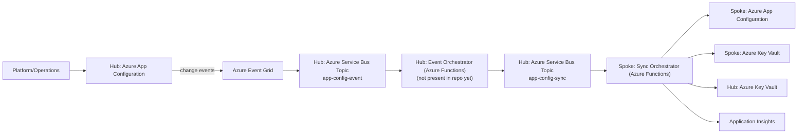
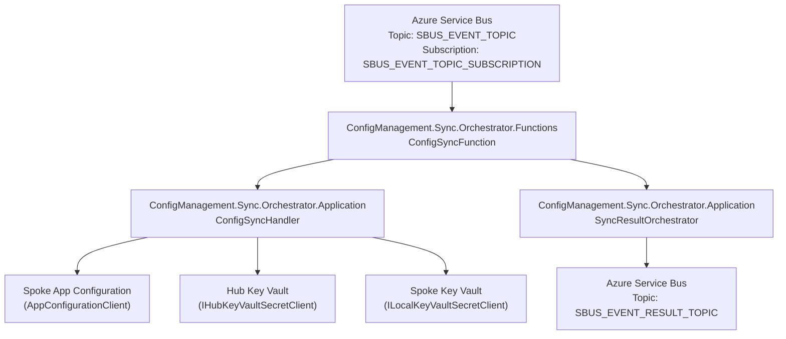
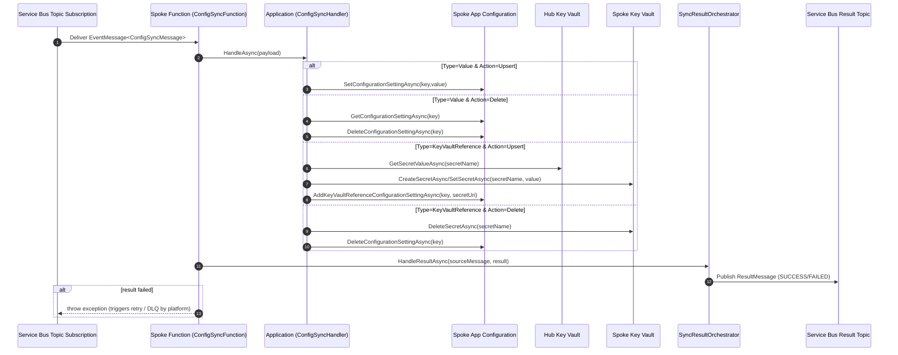

# Architecture – Config Management (Hub ↔ Spoke Sync)

This document describes the **current** architecture as implemented in this repository.
It is based on [docs/Agent-Knowledge-Baseline.md](Agent-Knowledge-Baseline.md) plus inspection of the existing code.

## Scope

- Covers the existing hub/spoke sync model, shared packages, and the Spoke Functions host.
- Documents the Hub orchestrator as it exists **today** (project scaffolding present; host logic not yet implemented in this repo).
- Does not propose redesigns.

---

## C4 – Level 1 (System Context)

### System
**ConfigManagement** synchronizes configuration and secrets from a **Hub** Azure subscription into one or more **Spoke** subscriptions.

### Primary actors
- **Platform/Operations**: owns the hub configuration source and deploys the spoke sync service.
- **Workload teams (Spokes)**: consume configuration from the spoke’s App Configuration and Key Vault.

### External systems and dependencies
- **Azure App Configuration (Hub)**: source of key/value changes.
- **Azure Event Grid**: delivers App Configuration change events (e.g., `KeyValueModified`, `KeyValueDeleted`).
- **Azure Service Bus (Hub)**: topics/subscriptions used to broadcast sync work to spokes.
- **Azure Key Vault (Hub)**: source of secrets referenced by configuration.
- **Azure Functions (Spoke)**: executes sync operations.
- **Azure App Configuration (Spoke)**: target store for key/value settings and Key Vault references.
- **Azure Key Vault (Spoke)**: target store for secrets.
- **Application Insights**: telemetry for the Functions worker.

### System context (conceptual)


### Service Bus resources (naming)

The architecture uses three logical topics in the hub Service Bus namespace:

- **Ingress topic**: `app-config-event`
  - Purpose: Event Grid delivery target for Azure App Configuration change events.
- **Sync work topic**: `app-config-sync`
  - Purpose: Canonical sync work messages (`EventMessage<ConfigSyncMessage>`) produced by the hub and consumed by spokes.
  - **Per-spoke subscription naming**: `app-config-sync/{Organisation}/{EnvironmentName}`
    - Each spoke creates its own subscription.
    - Each subscription has its own dedicated DLQ at the broker level (standard Service Bus behavior).
- **Results/telemetry topic**: `app-config-results-telemetry`
  - Purpose: Transaction-level results emitted by functions (`ResultMessage<...>`).

---

## C4 – Level 2 (Containers)

### Container inventory (as represented in repo)

#### Hub container (intended; host currently missing)
- **ConfigManagement.Event.Orchestrator**
  - Status: Clean Architecture projects exist (`.Application`, `.Domain`, `.Infrastructure`), but there is **no Azure Functions host project** in this repo at this time.
  - Intended runtime shape (per system description): an Azure Functions app that is triggered from a **Service Bus subscription** that receives **Event Grid-delivered App Configuration change events**.
  - Intended responsibilities:
    - Read App Configuration change notifications delivered via Service Bus
    - Determine whether the changed key represents a plain value or a Key Vault reference
    - Build and publish a canonical `EventMessage<ConfigSyncMessage>` to the sync work topic consumed by spokes

#### Spoke container (implemented)
- **ConfigManagement.Sync.Orchestrator.Functions**
  - Type: Azure Functions v4, **Isolated Worker** (.NET 8)
  - Trigger: Service Bus Topic Subscription (`ServiceBusTrigger`)
  - Responsibilities:
    - Receive sync work messages (`EventMessage<ConfigSyncMessage>`)
    - Apply configuration updates to spoke App Configuration
    - Copy secrets from hub Key Vault to spoke Key Vault (for Key Vault reference sync)
    - Publish a sync result message to a separate Service Bus topic

#### Spoke application container (implemented)
- **ConfigManagement.Sync.Orchestrator.Application**
  - Responsibilities:
    - Core orchestration logic (`ConfigSyncHandler`)
    - Result publishing orchestration (`SyncResultOrchestrator`)

#### Shared libraries (implemented)
- **ConfigManagement.Shared.ServiceBus**
  - Service Bus auth factory + publishers
  - Message envelopes (`EventMessage<T>`, `ResultMessage<T>`)
- **ConfigManagement.Shared.AppConfiguration**
  - Safe wrapper around `Azure.Data.AppConfiguration` (`AppConfigurationClient`)
  - Key Vault reference helper using the official App Configuration content type
- **ConfigManagement.Shared.KeyVault**
  - Safe wrapper around `Azure.Security.KeyVault.Secrets` (`KeyVaultSecretClient`)
  - Interfaces split for hub vs local usage (`IHubKeyVaultSecretClient`, `ILocalKeyVaultSecretClient`)
- **ConfigManagement.Shared.Domain**
  - Shared contracts/models used by orchestrators (`ConfigSyncMessage`, enums, results)

#### Hub containers (partially implemented)
- **ConfigManagement.Event.Orchestrator.{Domain|Application|Infrastructure}**
  - Clean Architecture layers exist (projects present).
  - No Functions/host project or triggering entrypoint is present in this repo at this time.
  - Intended responsibility (per baseline): receive App Configuration change events and classify/publish downstream.

### Container interactions (implemented path)


In deployed environments, these configuration values map to the concrete topic names above:

- `SBUS_EVENT_TOPIC` → `app-config-sync`
- `SBUS_EVENT_RESULT_TOPIC` → `app-config-results-telemetry`
- `SBUS_EVENT_TOPIC_SUBSCRIPTION` → `app-config-sync/{Organisation}/{EnvironmentName}`

---

## C4 – Level 3 (Components)

### Spoke Sync Orchestrator – Functions host

**Primary entrypoint**
- `ConfigSyncFunction.RunAsync(...)`
  - Trigger: `ServiceBusTrigger("%SBUS_EVENT_TOPIC%", "%SBUS_EVENT_TOPIC_SUBSCRIPTION%")`
  - Payload type: `EventMessage<ConfigSyncMessage>`
  - Behavior:
    1. Calls `IConfigSyncHandler.HandleAsync(message.Payload)`
    2. Calls `ISyncResultOrchestrator.HandleResultAsync(message, result)` to publish success/failure
    3. If result failed, throws an exception to surface failure to the Functions runtime

**Composition root**
- `Program.cs` wires:
  - Application Insights telemetry
  - `ConfigFactory` (environment variable configuration)
  - Service Bus result publisher (`ResultTopicPublisher`)
  - App Configuration client (`AppConfigurationClient`)
  - Key Vault clients (explicitly distinct hub vs local)

### Spoke Sync Orchestrator – Application layer

**`ConfigSyncHandler`**
- Routes by `ConfigSyncMessage.Type`:
  - `Value` → write/delete a simple App Configuration key/value
  - `KeyVaultReference` → synchronize a secret from hub Key Vault to spoke Key Vault, and manage an App Configuration Key Vault reference key

**Value sync (Type = Value)**
- Upsert (`SyncAction.Upsert`)
  - Calls `IAppConfigurationClient.SetConfigurationSettingAsync(key, value)`
- Delete (`SyncAction.Delete`)
  - Checks existence via `GetConfigurationSettingAsync(key)`
  - Deletes via `DeleteConfigurationSettingAsync(key)`
  - If missing, returns failure (treated as a failed run and will be retried by runtime)

**Key Vault reference sync (Type = KeyVaultReference)**
- Requires `KeyVaultSecretUri`.
- Extracts secret name from `.../secrets/{name}/...`.
- Upsert:
  1. Read secret from hub Key Vault (`IHubKeyVaultSecretClient.GetSecretValueAsync(name)`)
  2. Create/update secret in local Key Vault (`ILocalKeyVaultSecretClient.CreateSecretAsync`/`SetSecretAsync`)
  3. If the App Configuration key does not exist, create a Key Vault reference setting via `AddKeyVaultReferenceConfigurationSettingAsync(key, secretUri)`
     - Note: the current implementation uses the URI provided in the incoming message (`KeyVaultSecretUri`).
- Delete:
  - Requires the App Configuration key to exist; deletes local secret then deletes the App Configuration key.

**`SyncResultOrchestrator`**
- Produces `ResultMessage<ConfigSyncMessage>`:
  - Copies `EventType`, `Source`, `EnvironmentName`, `CorrelationId`, `TraceId`, `SpanId` from the source message (or current execution context)
  - Adds service metadata: `Organisation`, `Region`, `EnvironmentTier`, `ServiceName`
  - Sets `Status` to `SUCCESS` or `FAILED`
  - Publishes via `IResultPublisher` to the result topic
  - Note: the `EnvironmentName` rename is now reflected in the shared contracts and publishers.

### Shared Service Bus components

- `EventMessage<TPayload>`: standard envelope for work messages.
- `ResultMessage<TPayload>`: standard envelope for outcomes.
- `ResultTopicPublisher` publishes JSON to Service Bus with:
  - `CorrelationId` and `Subject = EventType`
  - Application properties: `status`, `source`, `environmentName`, optional `message`

---

## Hub ↔ Spoke Message Flow

### End-to-end flow (current + intended upstream)

1. Hub App Configuration key/value changes occur.
2. Event Grid emits App Configuration change events.
3. Event Grid delivers those events into the **Service Bus topic** `app-config-event` (ingress).
4. Hub Event Orchestrator (Azure Functions; **not present in repo yet**) is triggered by that Service Bus subscription.
5. Hub Event Orchestrator determines whether the changed key should be treated as:
   - `ConfigSyncMessageType.Value` (plain key/value), or
   - `ConfigSyncMessageType.KeyVaultReference` (key points to a Key Vault secret reference)
6. Hub Event Orchestrator publishes a canonical work message (`EventMessage<ConfigSyncMessage>`) to the **sync work topic** `app-config-sync`.
7. Each spoke has a Service Bus subscription; the Spoke Functions host processes the message.
8. Spoke writes to spoke App Configuration and/or spoke Key Vault (and reads hub Key Vault when needed).
9. Spoke publishes a result message to the Service Bus **results/telemetry topic** `app-config-results-telemetry`.
10. Failures surface via Functions runtime retries; Service Bus DLQ is available at the broker level.

### Hub message classification and mapping (intended)

The Hub Event Orchestrator’s purpose is to translate App Configuration change notifications into the canonical message consumed by the Spoke Sync Orchestrator.

**Input (from ingress topic)**
- App Configuration change event delivered via Event Grid (e.g., key-value modified/deleted).

#### Event types

| Event type | Meaning |
|---|---|
| `Microsoft.AppConfiguration.KeyValueModified` | Key-value created or replaced (treated as `SyncAction.Upsert`). |
| `Microsoft.AppConfiguration.KeyValueDeleted` | Key-value deleted (treated as `SyncAction.Delete`). |

#### Event schema (example)

Event Grid delivers an array of events; the hub orchestrator uses `data.key` and the event type to drive sync behavior:

```json
[
  {
    "id": "84e17ea4-66db-4b54-8050-df8f7763f87b",
    "topic": "/subscriptions/.../providers/microsoft.appconfiguration/configurationstores/contoso",
    "subject": "https://contoso.azconfig.io/kv/Foo?label=FizzBuzz",
    "data": {
      "key": "Foo",
      "label": "FizzBuzz",
      "etag": "FnUExLaj2moIi4tJX9AXn9sakm0"
    },
    "eventType": "Microsoft.AppConfiguration.KeyValueModified",
    "eventTime": "2019-05-31T20:05:03Z",
    "dataVersion": "1",
    "metadataVersion": "1"
  }
]
```

**Decision: Value vs Key Vault reference**
- If the changed App Configuration setting represents a plain value → use `ConfigSyncMessageType.Value`.
- If the changed setting represents a Key Vault reference → use `ConfigSyncMessageType.KeyVaultReference`.

**Output (to `SBUS_EVENT_TOPIC`)**
- `EventMessage<ConfigSyncMessage>` where `ConfigSyncMessage` fields are populated as:
  - `Key`: the App Configuration key
  - `Type`: `Value` or `KeyVaultReference`
  - `SyncAction`: `Upsert` for modified/created events; `Delete` for deleted events
  - `Value`: populated only for `Type = Value` (the setting’s value)
  - `KeyVaultSecretUri`: populated only for `Type = KeyVaultReference` (the hub Key Vault secret URI)

The envelope fields (`EventType`, `Source`, `EnvironmentName`, `CorrelationId`, `TraceId`, `SpanId`) should be set so downstream processing and result publishing can retain end-to-end traceability.

### Spoke execution flow (implemented)


---

## Key Design Decisions (Observed in Code)

1. **Clean Architecture alignment**
   - Separate Domain/Application/Infrastructure projects and a dedicated Functions host for the Spoke orchestrator.

2. **Shared package reuse as a hard constraint**
  - App Configuration, Key Vault, Service Bus, and shared domain contracts live under `src/Shared` and are consumed by orchestrators.

3. **Event envelope standardization**
  - Work and result messages carry: `EventType`, `Source`, `EnvironmentName`, `CorrelationId`, `TraceId`, `SpanId`, `TimestampUtc`, `Payload`.
  - Results include additional service metadata fields: `Organisation`, `Region`, `EnvironmentTier`, `ServiceName`.

4. **Result topic pattern for observability**
   - Every processed message leads to a result publication (`SUCCESS`/`FAILED`), enabling downstream monitoring without scraping function logs.

5. **Authentication via Azure.Identity factories**
   - Auth is centralized and selected via options (`Default`, `ManagedIdentity`, `ClientSecret`, etc.).
   - Deployment intent (per baseline) is Managed Identity, but factories support additional modes for local development/testing.

6. **Failure signaling uses exceptions after result publishing**
   - The Function publishes a result and then throws on failure, relying on Azure Functions + Service Bus retry/DLQ behavior for delivery guarantees.

7. **App Configuration semantics are explicit**
   - Create-only (`Add*`) vs upsert (`Set*`) methods are distinct.
   - Key Vault references use the official content type (`application/vnd.microsoft.appconfig.keyvaultref+json`).

---

## Configuration Surface (Observed)

The Spoke Functions host reads its configuration from environment variables via `ConfigFactory`, including:

- Service identity / environment metadata: `ORGANISATION`, `REGION`, `ENVIRONMENT_TIER`, `ENVIRONMENT_NAME`, `SERVICE_NAME`
- Service Bus:
  - `ServiceBus__FullyQualifiedNamespace`
  - `SBUS_EVENT_TOPIC`, `SBUS_EVENT_TOPIC_SUBSCRIPTION`, `SBUS_EVENT_RESULT_TOPIC`
  - plus `ServiceBus__AuthType`, `ServiceBus__ManagedIdentityClientId`, etc.
- App Configuration:
  - `AppConfiguration__Endpoint`
  - plus `AppConfiguration__AuthType`, `AppConfiguration__ManagedIdentityClientId`, etc.
- Key Vault:
  - `KeyVault__LocalVaultUri`, `KeyVault__HubKeyVaultUri`
  - plus `KeyVault__AuthType`, `KeyVault__ManagedIdentityClientId`, etc.
- Storage/idempotency placeholders:
  - `STORAGE_ACCOUNT_TABLE_URI`, `STORAGE_ACCOUNT_BLOB_URI`, `IDEMPOTENCY_TABLE_NAME`

These settings are intended to support **message idempotency** using the Azure Functions storage account (see Idempotency section below).

---

## Idempotency (Design)

The system processes messages from Service Bus with **at-least-once delivery** semantics. To avoid duplicated side-effects (e.g., repeated writes/secret copies) during retries, lock-loss, or duplicate deliveries, the Spoke Sync Orchestrator should implement an explicit idempotency mechanism.

### Storage location

- Use the **Spoke Function App’s storage account** (the same storage account created for the Functions host).
- Persist idempotency state in **Table Storage**.
- Table name is configured by `IDEMPOTENCY_TABLE_NAME`.

**Required configuration**

- `STORAGE_ACCOUNT_TABLE_URI`: the Table endpoint for the Function storage account (e.g., `https://<storage>.table.core.windows.net`).
- `IDEMPOTENCY_TABLE_NAME`: the table name (example from Terraform: `configSyncIdempotency`).

### Table schema (logical)

Store one row per processed message/event:

- `PartitionKey`: constant (e.g., `ConfigSync`).
- `RowKey`: **idempotency key**.
- Columns:
  - `Status`: `Started` | `Completed` | `Failed`
  - `CorrelationId`
  - `StartedUtc`, `CompletedUtc`
  - Optional operational fields: `LastError`, `EventType`, `Key`, `Type`, `SyncAction`

### Idempotency key

Preferred: the hub sets `CorrelationId` to a unique event identifier (for App Configuration events, the Event Grid `id` value is a suitable candidate). In that case:

- `RowKey = CorrelationId`

Fallback (if `CorrelationId` is not reliably unique): derive a stable key from message envelope + payload and hash it (e.g., SHA-256) to keep `RowKey` short.

### Processing flow

On message receipt:

1. **TryStart**: attempt to insert a new idempotency row (`Status=Started`).
   - If insert succeeds → proceed with the sync.
   - If insert conflicts (row exists):
     - If `Status=Completed` → treat as duplicate and **short-circuit** without reapplying changes; publish a `SUCCESS` result (optionally with a message like “Duplicate suppressed”).
     - If `Status=Started` → treat as “in-flight elsewhere” and fail fast (throw) so the platform retry policy can re-drive later.
     - If `Status=Failed` → allow retry by updating the row back to `Started` (using optimistic concurrency via ETag) or by leaving it as-is and letting a retry policy decide.

2. Execute the existing sync logic (App Configuration and/or Key Vault).

3. **MarkCompleted**: update the row to `Completed` and set `CompletedUtc`.

4. On exception:
   - **MarkFailed** (record error context if needed)
   - Re-throw so Service Bus retries/DLQ semantics still apply.

### Security / RBAC

The Function App managed identity requires permission to the storage account:

- `Storage Table Data Contributor` on the **Function storage account**.

### Operational considerations

- Data retention: idempotency rows grow over time. Define a retention window and a cleanup strategy (timer-driven cleanup function or storage lifecycle management where available).
- Observability: include `CorrelationId`, `TraceId`, and `SpanId` in logs and result messages so operators can correlate duplicates/retries with idempotency decisions.

---

## Distributed Tracing & Telemetry (Design)

This design follows the guidance in [docs/distributed-tracing-agent-knowledge.md](distributed-tracing-agent-knowledge.md).

### What to cover in the implementation

- **One Trace ID per end-to-end workflow**: the Trace ID should be created at the system boundary (in this architecture, the hub ingress publisher or the spoke consumer if the upstream does not supply it) and then propagated unchanged across messages and results.
- **One Span per operation**: each service execution should record its own span for message processing and any downstream calls (App Configuration, Key Vault, Service Bus).
- **Prefer automatic propagation**: rely on framework/SDK instrumentation (Application Insights and/or OpenTelemetry) to extract/inject W3C trace context where possible.
- **W3C Trace Context compatibility**: ensure trace context can be represented as `traceparent`/`tracestate` in transport metadata (especially across asynchronous messaging).
- **Logging uses telemetry context**: all logs emitted while processing a single message should carry `CorrelationId`, `TraceId`, and `SpanId` as structured fields (via a logging scope at the Functions entrypoint).

### Message contracts (what must be present)

The message envelope models already include a required `TraceId`. To align with span-per-operation guidance, the envelopes also carry an optional `SpanId`.

- Work envelope: `EventMessage<TPayload>` includes `TraceId` and `SpanId`
- Result envelope: `ResultMessage<TPayload>` includes `TraceId` and `SpanId`

When available, the publishers should also stamp these values into Service Bus application properties to support message tracing without deserializing the body.

---

## Contracts (Appendix)

This section summarizes the **current** message and domain contracts as implemented under `src/Shared`.

### Work message envelope: `EventMessage<TPayload>`

Used for sync work delivered to the Spoke function.

| Field | Type | Notes |
|---|---|---|
| `EventType` | `string` | Copied into Service Bus `Subject` by the event publisher. |
| `Source` | `string` | Also stamped into Service Bus application property `source`. |
| `EnvironmentName` | `string` | Renamed from `Environment` to avoid naming conflicts/ambiguity; also stamped into a Service Bus application property (see mapping below). |
| `CorrelationId` | `string` | Copied into Service Bus `CorrelationId` for end-to-end tracing. |
| `TraceId` | `string` | Transported in the JSON body (not mapped to Service Bus system properties). |
| `SpanId` | `string?` | Optional span identifier for the producing operation; used for logging and result correlation. |
| `Payload` | `TPayload` | For sync work, payload is `ConfigSyncMessage`. |
| `TimestampUtc` | `DateTimeOffset` | Defaults to `UtcNow` at creation time. |

### Sync payload: `ConfigSyncMessage`

The canonical payload consumed by the Spoke sync handler.

| Field | Type | When populated |
|---|---|---|
| `Key` | `string` | Always. The App Configuration key to mutate in the spoke. |
| `Type` | `ConfigSyncMessageType` | Always. Determines handling path. |
| `SyncAction` | `SyncAction` | Always. Upsert vs Delete. |
| `Value` | `string?` | Only when `Type = Value` and `SyncAction = Upsert`. |
| `KeyVaultSecretUri` | `string?` | Only when `Type = KeyVaultReference` (hub secret URI). |

### Enums

#### `ConfigSyncMessageType`

| Value | Meaning |
|---|---|
| `Value` | Sync a plain App Configuration key/value. |
| `KeyVaultReference` | Sync a Key Vault reference: copy secret hub→spoke, and ensure the spoke App Configuration key exists as a Key Vault reference. |

#### `SyncAction`

| Value | Meaning |
|---|---|
| `Upsert` | Create or update the target state in the spoke. |
| `Delete` | Delete the target state in the spoke. |

### Result message envelope: `ResultMessage<TPayload>`

Published by the Spoke after handling, to the result topic.

| Field | Type | Notes |
|---|---|---|
| `EventType` | `string` | Copied into Service Bus `Subject` by the result publisher. |
| `Source` | `string` | Also stamped into Service Bus application property `source`. |
| `Organisation` | `string` | Additional metadata for multi-tenant/multi-org routing and reporting. |
| `EnvironmentTier` | `string` | Additional metadata (e.g., dev/test/prod). |
| `EnvironmentName` | `string` | Renamed from `Environment` to avoid naming conflicts/ambiguity; also stamped into a Service Bus application property (see mapping below). |
| `ServiceName` | `string` | Additional metadata identifying the emitting service. |
| `CorrelationId` | `string` | Copied into Service Bus `CorrelationId`. |
| `TraceId` | `string` | Transported in the JSON body. |
| `SpanId` | `string?` | Optional span identifier for the emitting operation; used for logging and correlation. |
| `Status` | `string` | Currently `SUCCESS` or `FAILED`; also stamped into application property `status`. |
| `Message` | `string?` | Optional failure detail; stamped into application property `message` when non-empty. |
| `Payload` | `TPayload` | For sync outcomes, payload is `ConfigSyncMessage` (original work payload). |
| `TimestampUtc` | `DateTimeOffset` | Set by the orchestrator at publish time (`UtcNow`). |

### Service Bus mapping (publishers)

When publishing JSON messages:

- Work events (`EventTopicPublisher`)
  - System properties: `Subject = EventType`, `CorrelationId = CorrelationId`, `ContentType = application/json`
  - Application properties: `source`, `environmentName`, `traceId`, optional `spanId`

- Results (`ResultTopicPublisher`)
  - System properties: `Subject = EventType`, `CorrelationId = CorrelationId`, `ContentType = application/json`
  - Application properties: `status`, `source`, `environmentName`, `traceId`, optional `spanId`, optional `message`
  - Body fields: `Organisation`, `EnvironmentTier`, `EnvironmentName`, `ServiceName` are included in the JSON contract (in addition to the envelope fields above).
