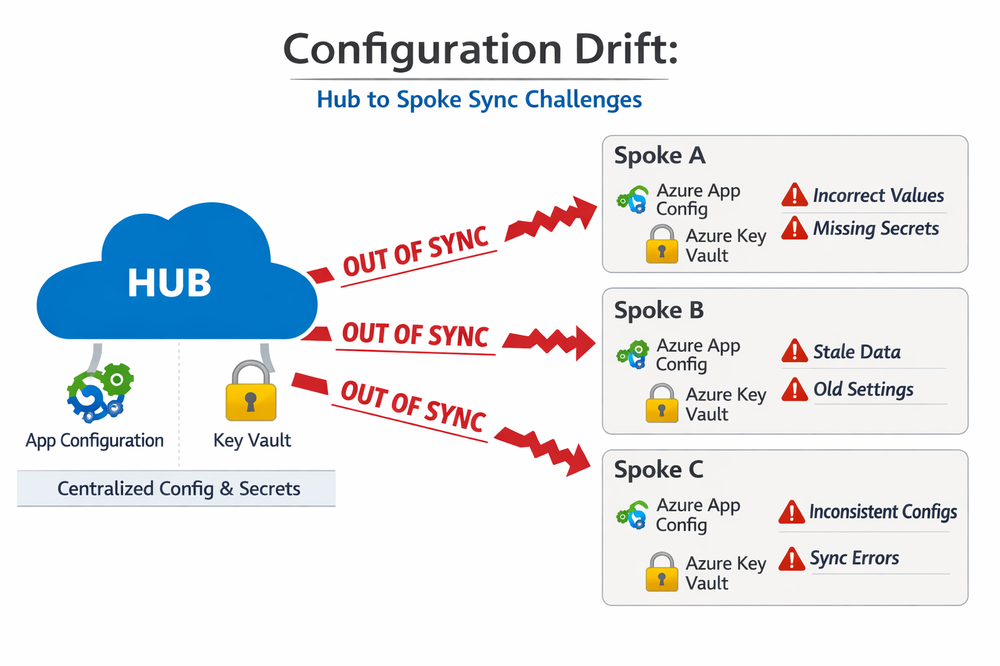
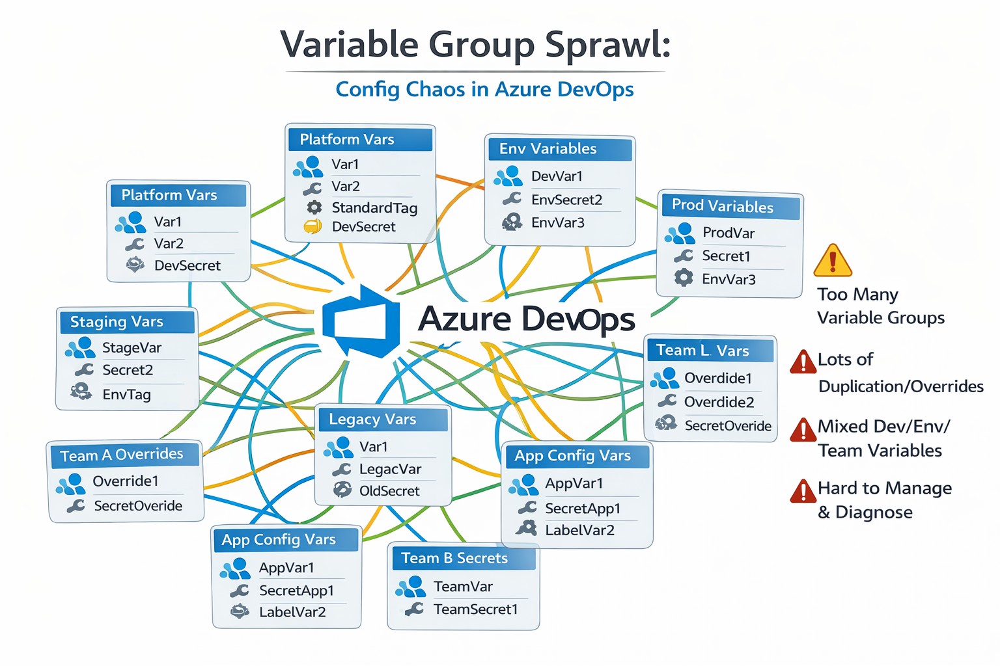

# Why Configuration Management Breaks at Scale (and Why Platforms Feel the Pain First)

You can build a modern Azure platform and still end up with one uncomfortable truth:

When something breaks, nobody can quickly answer, “What’s configured where?”

That’s not a tooling problem.
It’s an operating model problem.

This is the first post in a short series. I’m setting the tone, naming the pain, and teeing up a small proof of concept demo I’m building as I go.

---

## 1) When configuration becomes the product

Most platform work doesn’t fail because the code won’t deploy.
It fails because configuration has become a second system that nobody owns.

Support tickets pile up because every issue starts the same way: someone has to work out which values are effective, which values are intended, and where the change was made.

Local development starts to feel impossible because the “real” configuration only exists inside pipelines.
And developers get fatigued by the steady drip of “just one more variable”, “just one more override”, and “just one more environment difference”.

Eventually the platform stops feeling like a cohesive product and starts feeling like a collection of one-off decisions.

---

## 2) Why this matters

Configuration sprawl doesn’t just make engineers grumpy. It changes how the business experiences the platform.

MTTR goes up because incident response starts with archaeology: which variable group, which pipeline, which environment, and which value actually won.
Delivery velocity drops because every new environment adds another place to keep in sync.
Product ideation slows because experiments turn into heavyweight releases instead of safe, reversible configuration changes.

And if you care about developer experience, this is where it quietly falls apart: configuration becomes something you can only access through a pipeline run, not something you can reliably reproduce on a laptop.

If you’re trying to build a truly integrated platform (and not just a collection of scripts), this becomes a critical constraint.

---

## 3) The situation most teams end up in

If you work with Azure, Azure DevOps, and Infrastructure as Code, you’ve probably seen the same pattern.

Over time the platform accumulates lots of small, reasonable choices: a few variable groups here, a few more Terraform inputs there, a script to bridge a gap, and a quick secret stored where it’s easiest.

After a year or two, it tends to look like this:

- dozens (then hundreds) of Azure DevOps variable groups
- long lists of inputs passed into Terraform/Bicep templates
- repeated tags, labels, and environment values copied from pipeline to pipeline
- secrets stored where they’re convenient, not where they belong
- “configuration logic” spread across pipelines, scripts, and templates

Individually, each choice is defensible.
Collectively, it becomes a system you can’t reason about.

---

## 4) Where things start to break

The failure modes are consistent.

### Hub ↔ spoke drift

Most organisations use a hub-and-spoke model.
Keeping configuration aligned across spokes becomes manual, error-prone work.

### Variable group sprawl

Variable groups multiply until the dependency graph lives in people’s heads.
Then someone changes a value “just for one pipeline” and the blast radius is discovered later.

### IaC becomes a configuration dumping ground

Terraform and Bicep are great at declaring infrastructure.
They are not great as a long-term home for rapidly changing application and platform configuration.

### Local development becomes unrealistic

When configuration only exists in pipelines, local development becomes a compromise. It’s usually one of two paths:

- a fragile set of copy/paste steps, or
- an exercise in stubbing and guessing

Either way, you don’t get a simple, repeatable developer experience.

### Diagnosis becomes slower than the fix

Eventually, the slow part of incident response is not remediation.
It’s finding the effective configuration value and the last change that touched it.

---

## 5) The mistake we keep repeating

We keep treating configuration as a side-effect of deployment.

So we optimise for what’s easy in the moment. The tell-tale phrases are familiar:

- “just add one more variable to the pipeline”
- “pass it into Terraform for this environment”
- “store the secret in a variable group because it’s quick”

That works until the platform grows.
Then every change becomes coordination work.

---

## 6) What “good” actually looks like

Good doesn’t mean perfect.
It means the platform has a clear configuration story that engineers can explain in one minute, and new joiners can understand without tribal knowledge.

At a minimum, “good” looks like:

- **one shared model** (people know where configuration lives)
- **separation of values and secrets** (different lifecycles, different access)
- **environment convergence** rather than manual copying (spokes align themselves)
- **observability** (you can answer “what changed?” quickly)
- **safe rollback** (configuration changes are reversible and predictable)

This is where business value shows up. Not because configuration is exciting, but because it stops consuming support time, reduces avoidable incidents, and makes change feel routine again.

---

## 7) A more practical direction

The direction I’m exploring in this series is deliberately pragmatic. I’m not aiming for a perfect taxonomy of all configuration everywhere.
I’m aiming for a model that reduces drift, reduces support load, and makes local development feasible.

At a high level, the direction is:

- put shared configuration in a hub
- keep secrets in Key Vault
- distribute changes to spokes automatically
- use messaging/events so the system scales with the number of environments

Importantly, this is as much about operating model as technology. The tools help, but the leverage comes from reducing ambiguity:

- clear ownership
- clear change paths
- fewer places to make “just one small tweak”

---

## 8) What’s next

In the next post, I’ll walk through the demo pattern I’m building and why it’s a good fit for hub-and-spoke platforms:

- how hub-managed configuration flows into spokes
- how to handle values versus Key Vault references
- what you need to make it observable and supportable

The goal is simple: reduce MTTR, increase delivery velocity, and make local development feel possible again.
